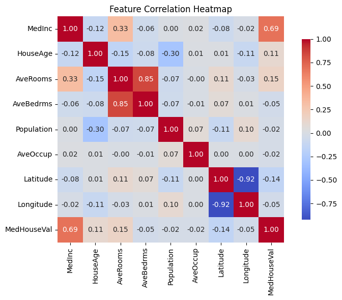
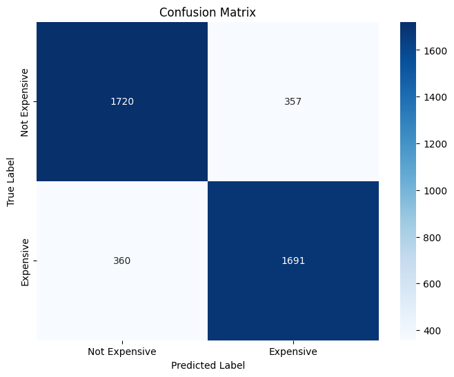
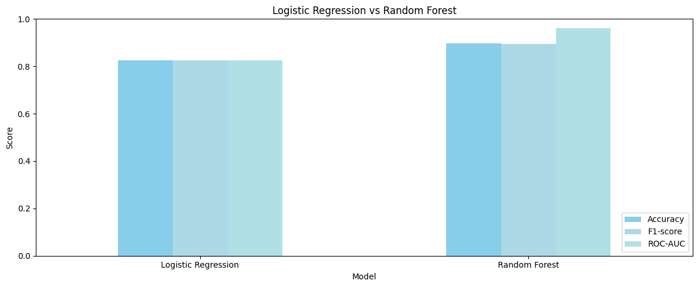
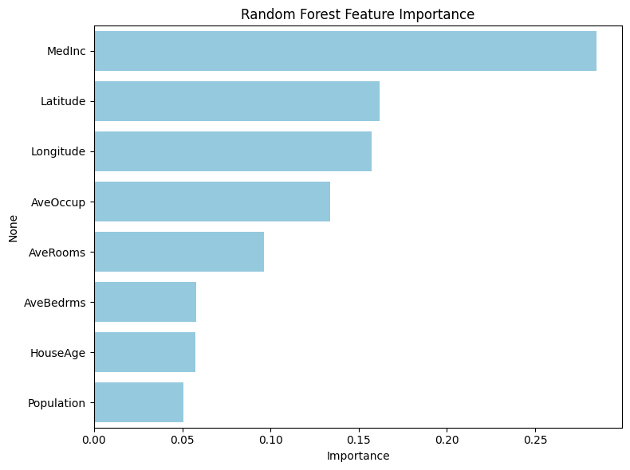
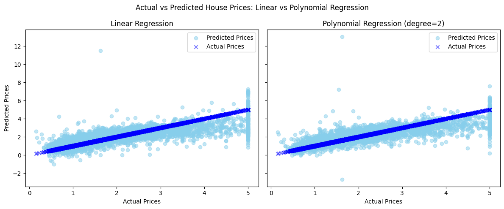
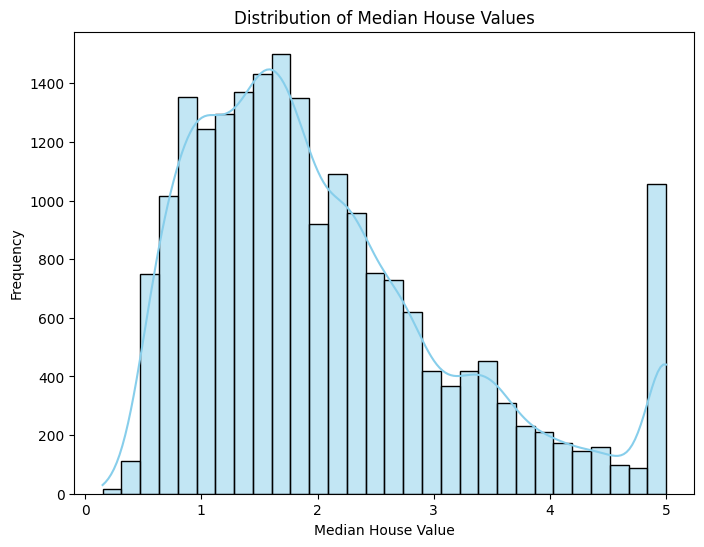
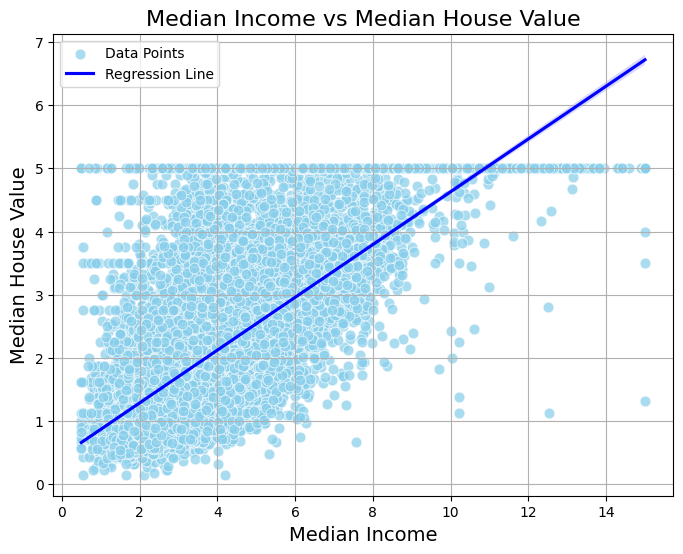

  

# California Housing | Classification & Regression

Predicting California housing prices two ways: as a classification problem (is a house **"expensive"** relative to the market?) and as a regression problem (what is its actual median value?) using the scikit-learn **California Housing** dataset, with a linear/simple model benchmarked against a stronger non-linear model on each task.

## Dataset details

- **Source:** `sklearn.datasets.fetch_california_housing` derived from the 1990 US Census.
- **Size:** 20,640 rows × 8 features, no missing values.
- **Features:** `MedInc`, `HouseAge`, `AveRooms`, `AveBedrms`, `Population`, `AveOccup`, `Latitude`, `Longitude`.
- **Target:** `MedHouseVal`, median house value per district, in units of $100,000, capped at 5.0 ($500k).
- **Classification label:** houses are labeled "expensive" if `MedHouseVal` is above the dataset's own median (a relative split, not a fixed dollar threshold).

 

## Insights

### Classification; *is a house "expensive"?*

Logistic Regression is benchmarked against a Random Forest on the same train/test split.

  

> The correlation heatmap flags `MedInc` as the feature most linearly related to price, which is why it dominates the Logistic Regression decision boundary. 

  

> The confusion matrix shows the errors are split almost evenly, 357 false positives vs. 360 false negatives out of 4,128 test houses, so the model isn't biased toward over- or under-predicting "expensive."

  

> Random Forest beats Logistic Regression on every metric, which means the true relationship between features and price bracket isn't fully linear.

  

> The Random Forest's feature importance chart shows which variables it actually leans on, useful for sanity-checking that the model's decisions line up with domain intuition rather than picking up on noise.

 

### Regression; *what is the actual price?*

Polynomial Regression (degree 2) is benchmarked against a plain Linear Regression baseline on the same features.

  

> Side by side, the Polynomial Regression's points hug the diagonal (perfect-prediction line) more tightly than the Linear Regression's, especially in the middle price range, visual confirmation that the degree-2 terms are capturing real curvature in the price relationship, not just adding noise.

<table>
<tr>
<td align="center">

**Price Distribution**

</td>
<td align="center">

**Income vs. Price**

</td>
</tr>
</table>

> Most median house values are between 1.0 and 2.5, with fewer high-value houses. The spike at 5.0 indicates that values above this limit were recorded as 5.0. The income-vs-price scatter shows a clear upward trend with meaningful spread, the raw signal both models are trying to capture.

 

## Findings / Results

<h3 align="center">Classification</h3>

<table>
  <thead>
    <tr>
      <th>Model</th>
      <th>Accuracy</th>
      <th>F1-score</th>
      <th>ROC-AUC</th>
    </tr>
  </thead>
  <tbody>
    <tr>
      <td>Logistic Regression</td>
      <td>82.6%</td>
      <td>0.83</td>
      <td>0.826</td>
    </tr>
    <tr>
      <td><strong>Random Forest</strong></td>
      <td><strong>89.7%</strong></td>
      <td><strong>0.90</strong></td>
      <td><strong>0.961</strong></td>
    </tr>
  </tbody>
</table>

- Logistic Regression's cross-validated accuracy (83.0%) closely tracks its test accuracy (82.6%), so it isn't overfit, it's simply less expressive than the Random Forest.
- Random Forest improves accuracy by **+7.1** points and ROC-AUC by **+0.135** over Logistic Regression.

 

<h3 align="center">Regression</h3>

<table>
  <thead>
    <tr>
      <th>Model</th>
      <th>MSE</th>
      <th>R²</th>
    </tr>
  </thead>
  <tbody>
    <tr>
      <td>Linear Regression</td>
      <td>0.556</td>
      <td>0.576</td>
    </tr>
    <tr>
      <td><strong>Polynomial Regression (Degree = 2)</strong></td>
      <td><strong>0.464</strong></td>
      <td><strong>0.646</strong></td>
    </tr>
  </tbody>
</table>

- Polynomial Regression cuts MSE by **~16.5%** and explains **~7** more percentage points of variance (R²) than the plain linear baseline.
- Degree was fixed at 2; this is a lower bound on how much a non-linear model could improve on the linear baseline.

 

## Team

</a>

---

If this helped you, consider starring the repository!

